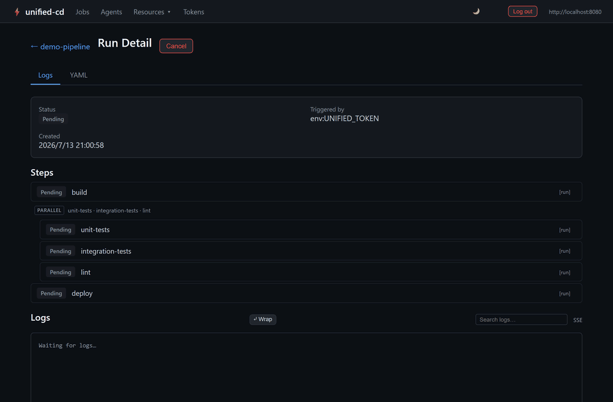
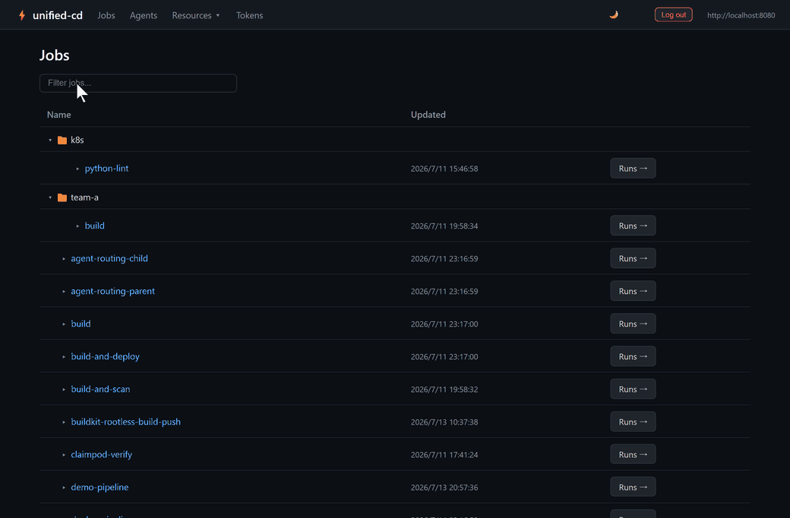

# unified-cd

An open-source CI/CD tool (Jenkins alternative) written in Go.

<p align="center">
  
  <br><em>Watch a multi-step DAG pipeline run in real time — steps go live and stream logs as they execute.</em>
</p>

<p align="center">
  
  <br><em>Browse the jobs dashboard, filter, and drill into a job's run history.</em>
</p>

**GitHub:** https://github.com/eirueimi/unified-cd

**Key features:** YAML-defined jobs · DAG step execution · Multi-platform agents (Linux, macOS, Windows, Kubernetes) · Secrets management · Webhook and cron triggers · High availability · Web UI · OIDC SSO

---

Per-agent enrollment gives every VM and Kubernetes agent independently
revocable credentials.

## Installation

```bash
# Controller
docker pull ghcr.io/eirueimi/unified-cd-controller:latest

# Kubernetes agent
docker pull ghcr.io/eirueimi/unified-cd-k8s-agent:latest
```

See the [Installation guide](https://eirueimi.github.io/unified-cd/getting-started/installation/) for Kubernetes manifests, pre-built binaries, and building from source.

---

## Quick Start

### Requirements

- Docker

### 1. Start services

```bash
cp .env.example .env        # edit UNIFIED_TOKEN if needed
docker compose up -d
```

- URL: http://localhost:8080

### 2. Log in to the Web UI

Open http://localhost:8080/ui/ in your browser. The Connection card will appear on the dashboard — enter the token you set in `.env` (default: `dev-token-change-me`) and click **Save**. The card disappears once authenticated.

> Alternatively, use OIDC SSO by starting with `docker compose -f docker-compose.yaml -f docker-compose.sso.yml up -d` and clicking **SSO Login**.

### 3. Install the CLI

Download from the [Releases page](https://github.com/eirueimi/unified-cd/releases), or build from source (requires Go 1.26+):

```bash
make build     # outputs bin/unified-cli
```

### 4. Configure the CLI

Point the CLI at the server and give it a token — pick any one:

```bash
# a) Interactive login: OIDC SSO device flow, or a PAT prompt when SSO is off.
#    Saves server + token to ~/.config/unified-cd/config.yaml.
unified-cli login --server http://localhost:8080

# b) Environment variables (handy for CI/scripts):
export UNIFIED_SERVER=http://localhost:8080
export UNIFIED_TOKEN=dev-token-change-me

# c) Config file:
mkdir -p ~/.config/unified-cd
cat > ~/.config/unified-cd/config.yaml <<EOF
server: http://localhost:8080
token: dev-token-change-me
EOF
```

Precedence is `--server`/`--token` flags > env vars (`UNIFIED_SERVER`/`UNIFIED_TOKEN`) > config file.

### 5. Run your first job

```bash
unified-cli apply -f examples/jobs/hello.yaml
RUN_ID=$(unified-cli run trigger hello)
unified-cli logs -f "$RUN_ID"
```

### 6. Connect an agent

Jobs execute on **agents**, which enroll with a one-time token minted by the controller:

```bash
# Mint a one-time enrollment token. --agent-id is optional (the server
# auto-generates agent-XXXXXXXX when omitted); labels are used for routing:
TOKEN=$(unified-cli agent enrollment create --label kind:linux --quiet)

# Start an agent; it enrolls, then persists a credential so restarts need no new token:
unified-cd-agent --server http://localhost:8080 --enrollment-token "$TOKEN"
```

Or pipe the token straight in:

```bash
unified-cli agent enrollment create --agent-id my-agent --quiet \
  | unified-cd-agent --server http://localhost:8080 --enrollment-token -
```

The token can also be given via `--enrollment-token-file` or `UNIFIED_AGENT_ENROLLMENT_TOKEN`.
See [docs/operator-manual/agents.md](docs/operator-manual/agents.md) for labels/routing and running the agent as a
systemd/launchd service, and [docs/operator-manual/kubernetes-integration.md](docs/operator-manual/kubernetes-integration.md)
for the Kubernetes agent.

Agent refresh credentials are stored by default at
`$HOME/.unified-cd/<agent-id>/credential.json`. A valid enrollment token
supplies the ID before local credential discovery; on a token-less, ID-less
restart, exactly one ID-scoped credential is discovered. If several exist,
start with `--id` or `--credential-file`. The former shared
`$HOME/.unified-cd/credential.json` location is ignored unless explicitly
selected. Existing installations should follow the
[ID-scoped credential migration guide](docs/operator-manual/migrations/agent-id-scoped-credentials.md).
Explicit VM agent IDs used with the default path must be portable canonical
names: lowercase ASCII letters and digits, with internal `.`, `_`, or `-`.
They must start and end with a letter or digit and cannot be Windows reserved
names such as `con` or `com1`.

### Tests

```bash
make test        # full test suite (requires Docker)
make test-short  # skip integration tests
```

---

## Architecture

- **Controller** — stateless HTTP server; schedules and dispatches jobs; manages all resources
- **Agent** — connects to controller via long-polling; executes job steps in a per-job workspace directory. Jobs are isolated by default: each claim runs inside a container ("claim pod": a pause container + `podTemplate` sidecars sharing one network namespace), the same model as the k8s-agent's real Pod. Jobs that need the host itself opt out with `spec.native: true` — see [Job Isolation](https://eirueimi.github.io/unified-cd/user-guide/writing-jobs/isolation-and-containers/#job-isolation-native-and-the-claim-pod).
- **k8s-agent** — Kubernetes-native agent; creates a Pod per job and exec's steps inside it
- **CLI** — `unified-cli` — apply YAML, trigger runs, stream logs, manage secrets and tokens

See the [Core Concepts guide](https://eirueimi.github.io/unified-cd/getting-started/concepts/) for the full architecture diagram.

---

## Documentation

The full documentation is published at **https://eirueimi.github.io/unified-cd/**.

### Getting Started
- **[Getting Started Guide](https://eirueimi.github.io/unified-cd/getting-started/quickstart/)** — installation, first job, parameters, secrets, schedules, webhooks

### Core References
- **[Job Reference](https://eirueimi.github.io/unified-cd/user-guide/writing-jobs/)** — complete Job YAML guide: steps, DAG, conditions, concurrency, artifacts, cache, templates
- **[Resource Reference](https://eirueimi.github.io/unified-cd/user-guide/resources/)** — schema for all resource kinds: Job, Schedule, WebhookReceiver, GitCredential, AppSource
- **[CLI Reference](https://eirueimi.github.io/unified-cd/reference/cli/)** — all commands and flags
- **[Configuration Reference](https://eirueimi.github.io/unified-cd/reference/configuration/)** — all environment variables and config file options for controller, agent, and k8s-agent
- **[Field Reference](https://eirueimi.github.io/unified-cd/reference/field-reference/)** — auto-generated field-level schema reference

### Feature Guides
- **[Authentication Guide](https://eirueimi.github.io/unified-cd/operator-manual/authentication/)** — static tokens, PATs, OIDC SSO (Dex), CLI login
- **[Secrets Management Guide](https://eirueimi.github.io/unified-cd/user-guide/secrets/)** — create, reference, and encrypt secrets; log masking
- **[Agent Labels and Routing](https://eirueimi.github.io/unified-cd/operator-manual/agents/)** — agentSelector, capability-based routing, hostname labels, Windows agents
- **[Kubernetes Integration Guide](https://eirueimi.github.io/unified-cd/operator-manual/kubernetes-integration/)** — k8s-agent setup, podTemplate patterns, RBAC
- **[High Availability Guide](https://eirueimi.github.io/unified-cd/operator-manual/high-availability/)** — controller redundancy, leader election, rolling deploys
- **[Operations Guide](https://eirueimi.github.io/unified-cd/operator-manual/operations/)** — state layout, backup, recovery runbook, monitoring
- **[Audit Log Guide](https://eirueimi.github.io/unified-cd/operator-manual/audit/)** — what's recorded/excluded, `GET /api/v1/audit`, `audit list`, retention
- **[Frontend Development Guide](https://eirueimi.github.io/unified-cd/contributing/frontend-development/)** — Svelte + Vite setup, hot reload, routing
- **[Troubleshooting](https://eirueimi.github.io/unified-cd/troubleshooting/)** — symptom-indexed fixes for common failures
- **[ID-Scoped Agent Credential Migration](https://eirueimi.github.io/unified-cd/operator-manual/migrations/agent-id-scoped-credentials/)** — move legacy shared agent credentials safely

### Infrastructure
- **[Kubernetes Manifests](https://github.com/eirueimi/unified-cd/blob/main/manifests/README.md)** — install manifests for production and evaluation
- **[VS Code Extension](https://github.com/eirueimi/unified-cd/blob/main/editors/vscode/README.md)** — YAML completion and validation for unified-cd files

---

## Resource Kinds

| Kind | Description |
|---|---|
| `Job` | Defines a pipeline: steps, parameters, concurrency rules, agent routing |
| `Schedule` | Triggers a job on a cron schedule |
| `WebhookReceiver` | Accepts HTTP webhooks (GitHub, HMAC, or unauthenticated) to trigger a job |
| `GitCredential` | Stores Git authentication for private repo access |
| `AppSource` | GitOps sync: automatically applies Job YAML files from a Git repository |

```yaml
apiVersion: unified-cd/v1
kind: Job
metadata:
  name: example
spec:
  params:
    inputs:
      - name: env
        type: string
        default: staging
  agentSelector:
    - kind:linux
  steps:
    - name: build
      run: make build
    - name: test
      needs: [build]
      run: make test
    - name: deploy
      needs: [test]
      if: 'params.env == "production"'
      run: make deploy
```

---

## Development

```bash
make build          # build all binaries
make test           # full test suite (requires Docker)
make test-short     # unit tests only
make dev-go         # hot-reload controller with air
make dev-ui         # Vite dev server for frontend
make ui-build       # build Svelte frontend assets (served by controller at runtime)
make manifests      # regenerate Kubernetes install manifests
make vscode-package # build VS Code extension .vsix
```

---

## Contributing

Contributions are welcome. Please read [CONTRIBUTING.md](CONTRIBUTING.md) — pull
requests require a [DCO](https://developercertificate.org/) sign-off
(`git commit -s`).

## License

Licensed under the [Apache License, Version 2.0](LICENSE). See [NOTICE](NOTICE)
for attribution.
